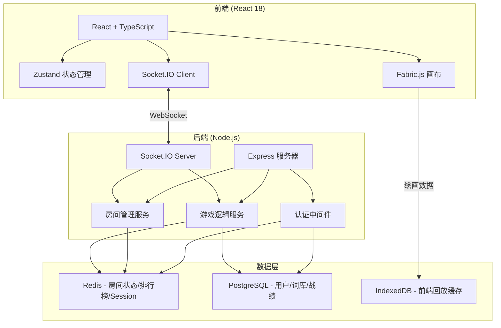

## 1. 架构设计



## 2. 技术说明
- **前端**：React 18 + TypeScript + TailwindCSS 3 + Vite
- **初始化工具**：vite-init (react-express-ts 模板)
- **后端**：Express 4 + TypeScript (ESM) + Socket.IO
- **数据库**：PostgreSQL (持久化) + Redis (实时缓存)
- **认证**：JWT (JSON Web Token)
- **画布**：Fabric.js 6
- **状态管理**：Zustand
- **回放存储**：IndexedDB (前端本地)

## 3. 路由定义
| 路由 | 用途 |
|------|------|
| `/login` | 用户登录/注册页面 |
| `/lobby` | 游戏大厅，房间列表 |
| `/room/:roomId` | 房间等待页 |
| `/game/:roomId` | 游戏主页面（涂鸦+猜词） |
| `/vote/:roomId` | 投票页面 |
| `/result/:roomId` | 结算页面 |
| `/replay/:roomId` | 回放页面 |

## 4. API定义

### 4.1 REST API
```typescript
// 认证相关
POST   /api/auth/register     { username: string } -> { token: string, user: User }
POST   /api/auth/login        { username: string } -> { token: string, user: User }
GET    /api/auth/me           -> { user: User }

// 房间相关
GET    /api/rooms              -> { rooms: Room[] }
POST   /api/rooms             { name: string, maxPlayers: number, rounds: number } -> { room: Room }
GET    /api/rooms/:id          -> { room: Room }

// 词库相关
GET    /api/words/random       -> { word: string, hint: string }

// 战绩相关
GET    /api/leaderboard        -> { entries: LeaderboardEntry[] }
GET    /api/users/:id/stats    -> { stats: UserStats }
```

### 4.2 WebSocket 事件
```typescript
// 客户端 -> 服务端
"room:join"           { roomId: string }
"room:leave"          { roomId: string }
"room:kick"           { roomId: string, userId: string }
"room:start"          { roomId: string }
"room:chat"           { roomId: string, message: string }
"game:draw"           { roomId: string, stroke: StrokeData }
"game:guess"          { roomId: string, guess: string }
"game:clear"          { roomId: string }
"game:undo"           { roomId: string }
"vote:cast"           { roomId: string, targetUserId: string }
"replay:save"         { roomId: string, roundId: string, strokes: StrokeData[] }

// 服务端 -> 客户端
"room:updated"        { room: Room }
"room:playerJoined"   { player: Player }
"room:playerLeft"     { userId: string }
"room:kicked"         {}
"game:started"        { round: GameRound }
"game:wordAssigned"   { word: string } // 仅涂鸦者收到
"game:hintReveal"     { hint: string } // 揭示部分字符
"game:stroke"         { stroke: StrokeData } // 广播绘画数据
"game:canvasCleared"  {}
"game:guessResult"    { correct: boolean, guesser?: string }
"game:roundEnd"      { word: string, scores: ScoreUpdate[] }
"game:gameEnd"        { finalScores: FinalScore[] }
"vote:start"          { candidates: VoteCandidate[] }
"vote:result"         { results: VoteResult[] }
"error"               { message: string }
```

### 4.3 核心数据类型
```typescript
interface User {
  id: string
  username: string
  avatar: string
  createdAt: string
}

interface Room {
  id: string
  name: string
  hostId: string
  maxPlayers: number
  rounds: number
  status: "waiting" | "playing" | "voting" | "finished"
  players: Player[]
  currentRound: number
  createdAt: string
}

interface Player {
  userId: string
  username: string
  avatar: string
  score: number
  isDrawing: boolean
  hasGuessed: boolean
  isConnected: boolean
}

interface StrokeData {
  type: "path"
  points: { x: number; y: number }[]
  color: string
  width: number
  tool: "pen" | "eraser"
  timestamp: number
}

interface GameRound {
  roundNumber: number
  drawerId: string
  word: string // 仅服务端和涂鸦者知晓
  hint: string
  timeLeft: number
  startTime: number
}

interface ScoreUpdate {
  userId: string
  pointsEarned: number
  reason: "guess" | "assist" | "vote"
}

interface VoteCandidate {
  userId: string
  username: string
  avatar: string
  thumbnailDataUrl: string
}

interface VoteResult {
  userId: string
  votes: number
  isWinner: boolean
}

interface LeaderboardEntry {
  userId: string
  username: string
  avatar: string
  totalScore: number
  gamesPlayed: number
  wins: number
}
```

## 5. 服务端架构图

```mermaid
graph LR
    "Router / Controller" --> "AuthService"
    "Router / Controller" --> "RoomService"
    "Router / Controller" --> "GameService"
    "Router / Controller" --> "VoteService"
    "RoomService" --> "RoomRepository"
    "GameService" --> "GameRepository"
    "AuthService" --> "UserRepository"
    "RoomRepository" --> "Redis + PostgreSQL"
    "GameRepository" --> "Redis + PostgreSQL"
    "UserRepository" --> "PostgreSQL"
    "Socket.IO Handler" --> "GameService"
    "Socket.IO Handler" --> "RoomService"
    "Socket.IO Handler" --> "VoteService"
```

## 6. 数据模型

### 6.1 数据模型定义

```mermaid
erDiagram
    "users" {
        string id PK
        string username UK
        string avatar
        timestamp created_at
    }
    "rooms" {
        string id PK
        string name
        string host_id FK
        integer max_players
        integer rounds
        string status
        integer current_round
        timestamp created_at
    }
    "room_players" {
        string room_id FK
        string user_id FK
        integer score
        boolean is_connected
    }
    "words" {
        integer id PK
        string word
        string category
        string hint
    }
    "game_rounds" {
        integer id PK
        string room_id FK
        integer round_number
        string drawer_id FK
        string word_id FK
        integer duration
        timestamp started_at
        timestamp ended_at
    }
    "guesses" {
        integer id PK
        integer round_id FK
        string user_id FK
        string content
        boolean is_correct
        integer time_elapsed
    }
    "votes" {
        integer id PK
        integer round_id FK
        string voter_id FK
        string candidate_id FK
    }
    "replay_metadata" {
        integer id PK
        integer round_id FK
        string user_id FK
        integer stroke_count
        integer duration
        string storage_key
        timestamp created_at
    }
    "leaderboard" {
        string user_id PK FK
        integer total_score
        integer games_played
        integer wins
    }
    "users" ||--o{ "room_players" : "参与"
    "rooms" ||--o{ "room_players" : "包含"
    "rooms" ||--o{ "game_rounds" : "进行"
    "users" ||--o{ "game_rounds" : "绘画"
    "words" ||--o{ "game_rounds" : "出题"
    "game_rounds" ||--o{ "guesses" : "记录"
    "users" ||--o{ "guesses" : "提交"
    "game_rounds" ||--o{ "votes" : "产生"
    "users" ||--o{ "votes" : "投票"
    "game_rounds" ||--o{ "replay_metadata" : "存档"
    "users" ||--o{ "replay_metadata" : "拥有"
    "users" ||--o{ "leaderboard" : "统计"
```

### 6.2 数据定义语言

```sql
CREATE TABLE users (
    id UUID PRIMARY KEY DEFAULT gen_random_uuid(),
    username VARCHAR(30) NOT NULL UNIQUE,
    avatar VARCHAR(50) NOT NULL DEFAULT 'default',
    created_at TIMESTAMP WITH TIME ZONE DEFAULT NOW()
);

CREATE TABLE rooms (
    id UUID PRIMARY KEY DEFAULT gen_random_uuid(),
    name VARCHAR(50) NOT NULL,
    host_id UUID REFERENCES users(id),
    max_players INTEGER NOT NULL DEFAULT 8,
    rounds INTEGER NOT NULL DEFAULT 3,
    status VARCHAR(20) NOT NULL DEFAULT 'waiting',
    current_round INTEGER NOT NULL DEFAULT 0,
    created_at TIMESTAMP WITH TIME ZONE DEFAULT NOW()
);

CREATE TABLE room_players (
    room_id UUID REFERENCES rooms(id) ON DELETE CASCADE,
    user_id UUID REFERENCES users(id) ON DELETE CASCADE,
    score INTEGER NOT NULL DEFAULT 0,
    is_connected BOOLEAN NOT NULL DEFAULT true,
    PRIMARY KEY (room_id, user_id)
);

CREATE TABLE words (
    id SERIAL PRIMARY KEY,
    word VARCHAR(100) NOT NULL,
    category VARCHAR(50) NOT NULL DEFAULT 'general',
    hint VARCHAR(200)
);

CREATE TABLE game_rounds (
    id SERIAL PRIMARY KEY,
    room_id UUID REFERENCES rooms(id) ON DELETE CASCADE,
    round_number INTEGER NOT NULL,
    drawer_id UUID REFERENCES users(id),
    word_id INTEGER REFERENCES words(id),
    duration INTEGER NOT NULL DEFAULT 60,
    started_at TIMESTAMP WITH TIME ZONE,
    ended_at TIMESTAMP WITH TIME ZONE
);

CREATE TABLE guesses (
    id SERIAL PRIMARY KEY,
    round_id INTEGER REFERENCES game_rounds(id) ON DELETE CASCADE,
    user_id UUID REFERENCES users(id),
    content VARCHAR(100) NOT NULL,
    is_correct BOOLEAN NOT NULL DEFAULT false,
    time_elapsed INTEGER NOT NULL DEFAULT 0
);

CREATE TABLE votes (
    id SERIAL PRIMARY KEY,
    round_id INTEGER REFERENCES game_rounds(id) ON DELETE CASCADE,
    voter_id UUID REFERENCES users(id),
    candidate_id UUID REFERENCES users(id),
    UNIQUE(round_id, voter_id)
);

CREATE TABLE replay_metadata (
    id SERIAL PRIMARY KEY,
    round_id INTEGER REFERENCES game_rounds(id) ON DELETE CASCADE,
    user_id UUID REFERENCES users(id),
    stroke_count INTEGER NOT NULL DEFAULT 0,
    duration INTEGER NOT NULL DEFAULT 0,
    storage_key VARCHAR(200),
    created_at TIMESTAMP WITH TIME ZONE DEFAULT NOW()
);

CREATE TABLE leaderboard (
    user_id UUID PRIMARY KEY REFERENCES users(id) ON DELETE CASCADE,
    total_score INTEGER NOT NULL DEFAULT 0,
    games_played INTEGER NOT NULL DEFAULT 0,
    wins INTEGER NOT NULL DEFAULT 0
);

CREATE INDEX idx_rooms_status ON rooms(status);
CREATE INDEX idx_game_rounds_room ON game_rounds(room_id);
CREATE INDEX idx_guesses_round ON guesses(round_id);
CREATE INDEX idx_words_category ON words(category);
CREATE INDEX idx_leaderboard_score ON leaderboard(total_score DESC);
```
